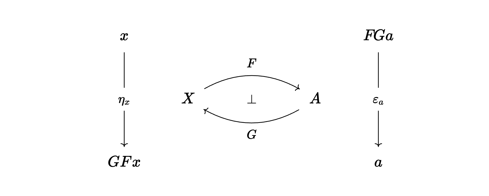

# Full or Faithful Adjoints

We present a theorem that is useful in many situations. It gives necessary and sufficient conditions for an adjoint to be full or to be faithful in terms of the (co)unit of the adjunction.

Let $F:X\to A$, $G:A\to X$, $F\dashv G$, $\eta_x:x\to GFx$, $\epsilon_a:FGa\to a$.

Mac Lane, page 88:

This is proved using:

From the lemma we obtain the theorem

| counit componentwise | right adjoint|
|:---:|:---:|
|   epi |  faithful |
|  split mono | full |

and its dual

| unit componentwise| left adjoint|
|:---:|:---:|
|  mono | faithful |
| split epi | full |

as corollaries.

## The proof

For variety, we prove the dual of lemma and theorem.

**Lemma:** Let $f^\ast:X(-,y) \to X(-,z)$ given by Yoneda for $f:y\to z$. Then $f^\ast$ is componentwise injective iff $f$ is mono and $f^\ast$ is componentwise onto iff $f$ is split epi.

*Proof:* This is straightforward from the respective definitions.

To prove the dual of the theorem, consider

$$X(x,y)\stackrel {F_{x,y}} \longrightarrow 
A(Fx,Fy) \stackrel \cong \longrightarrow 
X(x,UFy)$$

which is the transformation natural in $x$ determined (via Yoneda) by the unit $\eta_y:y\to UFy$.

The lemma tells us that the natural transformation (hence $F_{x,y}$) is componentwise injective iff $\eta_y$ is mono and is componentwise surjective iff $\eta_y$ is split epi.

We have shown that $F$ is faithful iff the unit is componentwise mono and full iff the unit is componentwise split epi. QED

**Example:** The inclusion from Boolean algebras to distributive lattice has a faithful left adjoint. The unit includes a DL  $A$ into the free BA over $A$, freely adding negation. That the unit is injective means that Boolean logic is conservative over positive logic (extending $A$ by negation does not introduce new equations on $A$).

**Example:** If $X$ is the category of sets and $A$ is a category of algebras (a variety or quasi-variety), then the left-adjoint $F$ (free construction) and the right-adjoint $G$ (forgetful functor) are faithful. This corresponds to the unit (insertion of generators) being mono (injective) and the counit (algebraic structure) being epi (surjective). 

**Example:** Let $X$ be a category of algebras (variety) and $A$ be a subvariety defined by imposing additional equations. Then the inclusion $G:A\to X$ has a left-adjoint $F:X\to A$. The inclusion is full and faithful, hence the counit is iso. The unit $x\to GFx$ takes the quotient of an algebra $x$ wrt the equations, hence is epi but not necessarily split epi, so we cannot conclude that $F$ is full. For example, ... 

---

[Diagrams](https://q.uiver.app/#q=WzAsNixbMSwxLCJYIl0sWzMsMSwiQSJdLFswLDAsIngiXSxbMCwyLCJHRngiXSxbNCwwLCJGR2EiXSxbNCwyLCJhIl0sWzAsMSwiRiIsMCx7ImN1cnZlIjotMn1dLFsxLDAsIkciLDAseyJjdXJ2ZSI6LTJ9XSxbMCwxLCJcXGJvdCIsMSx7InN0eWxlIjp7ImJvZHkiOnsibmFtZSI6Im5vbmUifSwiaGVhZCI6eyJuYW1lIjoibm9uZSJ9fX1dLFsyLDMsIlxcZXRhX3giLDFdLFs0LDUsIlxcdmFyZXBzaWxvbl9hIiwxXV0=)

