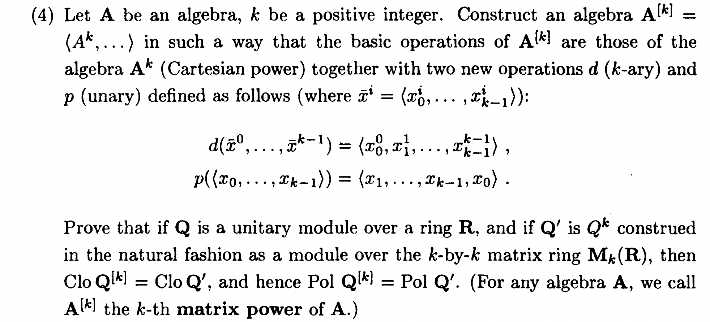

# Introduction

(under construction)

In very general terms, two theories (formalized as categories) are Morita equivalent if their categories of models are equivalent. 
- The question posed by Morita was when two rings induce equivalent categories of modules. For example, any ring $R$ is Morita equivalent to the ring of 
$n\times n$ matrices with elements from $R$. We will see variations of this result below.
- Presheaf categories $[\mathcal C^{op},\sf Set]$ and  $[\mathcal D^{op},\sf Set]$ are equivalent iff the closure under retracts of $\mathcal C$ and of $\mathcal D$ are equivalent. This closure is known as the Karoubi envelope, or also as closure under splitting of idempotents, a terminology that will be explained below.
- In the following, we will be mainly interested in the question when two algebraic theories give rise to equivalent categories (varieties) of algebras.

To see why Morita equivalence of varieties is interesting let us look at some examples.

## Example

This is Example 2 in {cite}`McKenzie:equivalence-for-varieties`.

Consider algebras (which I call RBI-algebras for now) given by a unary operation $s$ and a binary operation $\cdot$ satisfying the equations

\begin{gather}
x\cdot (y\cdot z) = (x\cdot y)\cdot z\\
x\cdot y \cdot z = x\cdot z\\
x\cdot x = x\\
s(s(x)) = x
\end{gather}

**Fact:** Every RBI-algebra $B$ is of the form $B=A\times A$. 

We can say more: The category $\sf RBI$ of RBI-algebras ("RBI" as in "rectangular bands with involution") is equivalent to the category $\sf Set$.

**Observation:** One can interpret the equations thinking of the elements of an RBI-algebra as pairs $(a,b)$ with operations defined by 
\begin{gather}
(a,b) \cdot (c,d)=(a,d)\\
s(a,b)=(b,a)
\end{gather}

In other words, every set $A$ gives rise to an RBI-algebra $A^2$.

**Exercise:** Show that (with $s$ and $\cdot$ defined as in the observation above) the operation $H$ 

\begin{align}
{\sf Set} & \stackrel H ⟶ \sf RBI\\
A & \ \mapsto \ (A^2,s,\cdot)
\end{align}

is an equivalence of categories:
- $H$ is a functor.
- $H$ is essentially surjective.
- $H$ is full and faithful.

One aspect that makes equivalences like this interesting is that they may not preserve free algebras:

**Exercise:** Show that the free RBI over $X$ has $(2X)^2$ elements.

**Remark/Question:** The category $\sf Set$ can be seen as a category of algebras defined by no operations and no equations. As we have seen $\sf Set^{[2]}$ is equivalent to RBI which is defined by a much more sophisticated algebraic theory. Is there a general theory that explains which algebraic theories give rise to equivalent categories of algebras? Conversely, given a category of algebras, can we classify all equivalent categories?

To answer these and similar questions is the purpose of  Morita equivalence. 

As a warm-up, we notice that the proof of the previous exercise can be decomposed into two steps. Instead of doing $\sf Set \to RBI$ in one go we want to introduce an intermediate step $\sf Set \to Set^{[2]}\to RBI$. The reason to do this is that the first step will turn out to be part of a general method.

**Exercise:** The category $\sf Set^{[2]}$ has as objects sets $A^2=A\times A = \{(a,b) \mid a,b \in A\}$ with operations formed from projections $p^{2k}_i:{A^2}^k\to A$, and tupling $\langle p^{2k}_i,p^{2k}_j\rangle: {A^2}^k\to A^2$. Show that the obvious functor $\sf Set\to Set^{[2]}$ is an equivalence of categories.[^setSet2]

[^setSet2]: One can break this down as follows.
    - List the four operations $A^2\to A^2$, which we will call $id$, $l$ (for left), $r$ (for right), $s$ (for swap). 
    - Define an operation $\cdot$ of type $(A^2)^2 \to A^2$ such that 
        \begin{gather}
        x\cdot (y\cdot z) = (x\cdot y)\cdot z\\
        x\cdot y \cdot z = x\cdot z\\
        x\cdot x = x
        \end{gather}
    - Define $l$ and $r$ using $s$ and $\cdot$.
    - Show that a morphism $A^2\to B^2$ compatible with maps defined from projections must be of the form $(a,a')\mapsto (f(a),f(a'))$ for some $f:A\to B$.

## Matrix Power 

**Definition:** Let $\mathcal A$ be category of algebras and $n\in\mathbb N$. For each $A\in\mathcal A$, the algebra $A^{[n]}$ has carrier $A^n$ and $k$-ary operations $(A^n)^k\to A^n$ have components $(A^n)^k\to A^n \to A$ given by $\mathcal A$-terms. For a category $\mathcal A$ one denotes by $\mathcal A^{[n]}$ the category of algebras isomorphic to some $A^{[n]}$ for $A\in\mathcal A$.

**Remark:** Note that in the previous exercises on RBI the operation ${\cdot}:{A^2}^2\to A^2$ picks out the diagonal of a $2\times 2$ matrix while $s:{A^2}\to A^2$ permutes the elements. The observation that these operations give rise to an equivalence $\sf RBI\simeq \sf Set^{[n]}$ generalizes to modules $M$ over a ring: The module $M^n$ over the ring of $n\times n$-matrices is $M^[n]$.[^hobbyMcKenzieModule] 

[^hobbyMcKenzieModule]: In the words of {cite}`Hobby-McKenzie`, Exercise 3.12(4) and Remark 13.4:

**Exercise:** ({cite}`McKenzie:equivalence-for-varieties`, Example 1) Generalizing from the above, show that $\sf \mathcal A\to \mathcal A^{[n]}$ is an equivalence of categories.

(to be continued)

